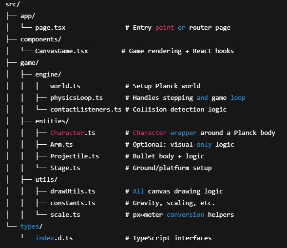

# rooftop-shooters-clone
This is a clone of the game rooftop shooters. https://poki.com/en/g/rooftop-snipers

# Folder Structure Breakdown 

# Rooftop Shooters Clone Roadmap

## Milestone 1: Character Physics Refinement
- **Implement rounded character bases**:
  - Replace box physics with circle fixtures at character bottoms
  - Adjust mass distribution for realistic rolling physics
  - Create angular damping parameters for controlled rolling
- **Refine collision response**:
  - Increase restitution for character-to-character collisions
  - Implement elastic bounce physics
  - Adjust friction values for rolling behavior
- **Improve jump mechanics**:
  - Add variable jump height based on key press duration
  - Implement landing impact physics that triggers rolling

## Milestone 2: Arm Aiming Mechanics
- **Complete arm rotation system**:
  - Implement mouse-based aiming for player 1
  - Add keyboard-based aiming for player 2 (arrow keys)
  - Create smooth rotation with acceleration/deceleration
- **Develop arm constraints**:
  - Limit rotation angles (90° up to 45° down)
  - Prevent arm clipping through character bodies
  - Add visual aiming guide/reticle
- **Implement recoil physics**:
  - Create backward force when shooting
  - Add visual recoil animation

## Milestone 3: Shooting & Projectile System
- **Create projectile physics**:
  - Implement bullet trajectory with gravity
  - Add projectile collision detection
  - Create impact force calculations
- **Develop ammo mechanics**:
  - Add reloading system
  - Implement ammo counter UI
  - Create different weapon types (pistol, shotgun)
- **Add shooting effects**:
  - Muzzle flash animations
  - Bullet casing ejection physics
  - Smoke trails

## Milestone 4: Character Customization
- **Implement visual variations**:
  - Different character colors/themes
  - Hat/accessory options
  - Skin tone variations
- **Add physics customization**:
  - Weight classes (light/medium/heavy)
  - Bounciness parameters
  - Roll resistance settings
- **Create unlock system**:
  - Win-based progression
  - Achievement unlocks
  - Random loot drops

## Milestone 5: Stage Hazards & Environment
- **Design interactive rooftops**:
  - Slippery surfaces (rain-slicked areas)
  - Breakable objects (vents, AC units)
  - Moving platforms (construction cranes)
- **Implement environmental hazards**:
  - Electrical wires
  - Falling debris
  - Temporary cover objects
- **Add stage-specific mechanics**:
  - Wind effects on projectiles
  - Low-friction areas
  - Destructible terrain

## Milestone 6: Game Modes & Rules
- **Implement core game modes**:
  - Stock (limited lives)
  - Timed matches
  - Sudden death
- **Create scoring system**:
  - Points for hits/kills
  - Style points for trick shots
  - Combo multipliers
- **Add match progression**:
  - Best-of-three rounds
  - Stage transitions between rounds
  - Victory screens

## Milestone 7: Visual Polish & Effects
- **Replace placeholders with proper art**:
  - Character sprite sheets
  - Themed rooftop backgrounds
  - Particle effects
- **Implement animations**:
  - Character wobble/rolling
  - Arm recoil animation
  - Hit reactions
- **Add camera effects**:
  - Screen shake on impacts
  - Slow-motion for final blows
  - Dynamic zoom

## Milestone 8: Audio Design
- **Create sound effects**:
  - Character jumps and landings
  - Weapon sounds (shots, reloads)
  - Impact sounds (body, environment)
- **Implement physics audio**:
  - Rolling sounds (intensity based on speed)
  - Collision sounds (pitch based on force)
  - Surface-specific sounds
- **Add voice lines**:
  - Character taunts
  - Pain reactions
  - Victory phrases

## Milestone 9: Online Multiplayer
- **Implement networking**:
  - WebSocket connection system
  - Matchmaking lobby
  - Room creation
- **Add netcode features**:
  - Lag compensation
  - Client-side prediction
  - Server reconciliation
- **Create online systems**:
  - Leaderboards
  - Friend invites
  - Region selection

## Milestone 10: Polish & Release
- **Refine game feel**:
  - Adjust hit pause timing
  - Tweak screen shake intensity
  - Perfect rumble feedback
- **Add quality-of-life features**:
  - Remappable controls
  - UI scaling options
  - Performance settings
- **Prepare for launch**:
  - Tutorial system
  - Bot difficulty settings
  - Replay sharing
- **Post-launch planning**:
  - New stage designs
  - Seasonal events
  - Weapon variants

